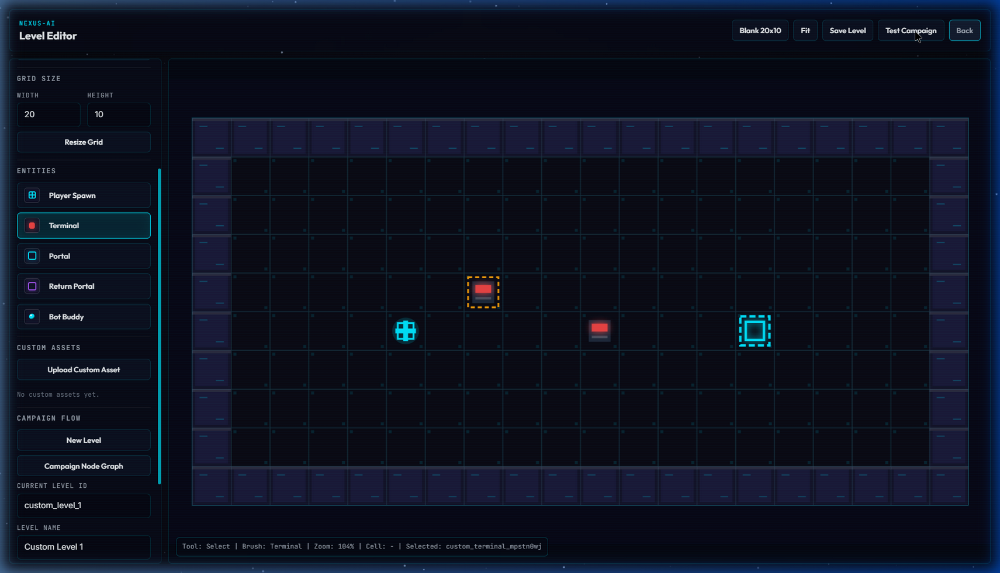
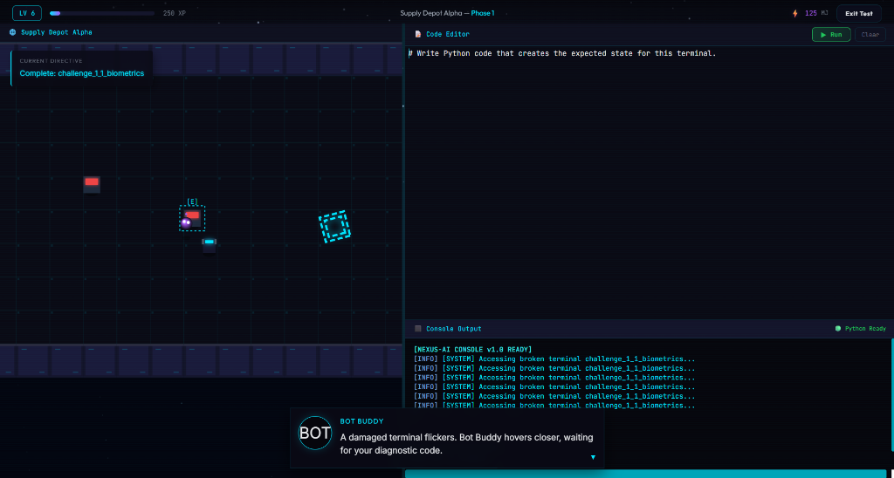
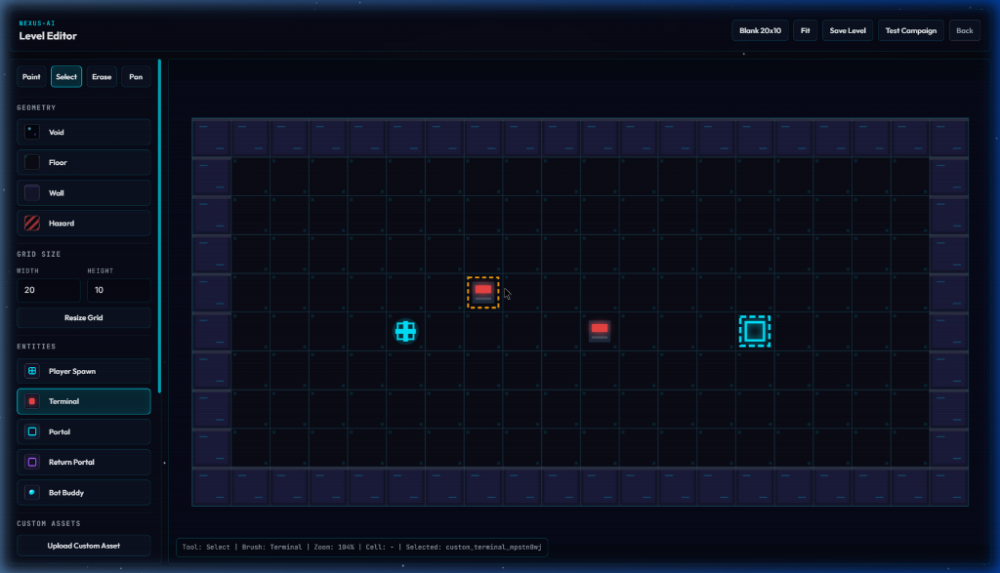
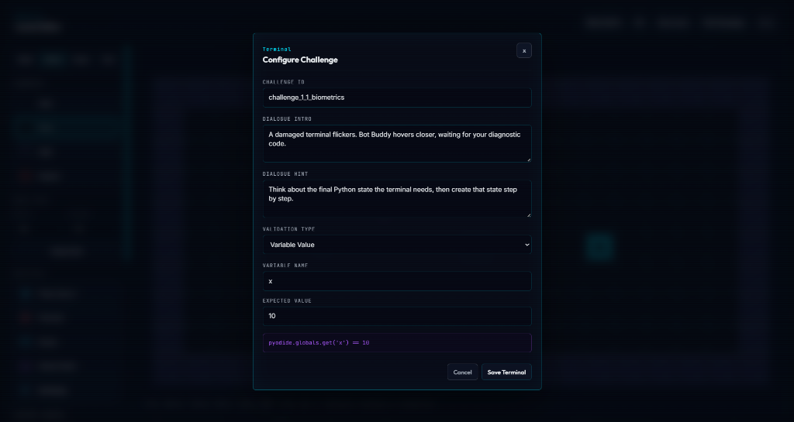
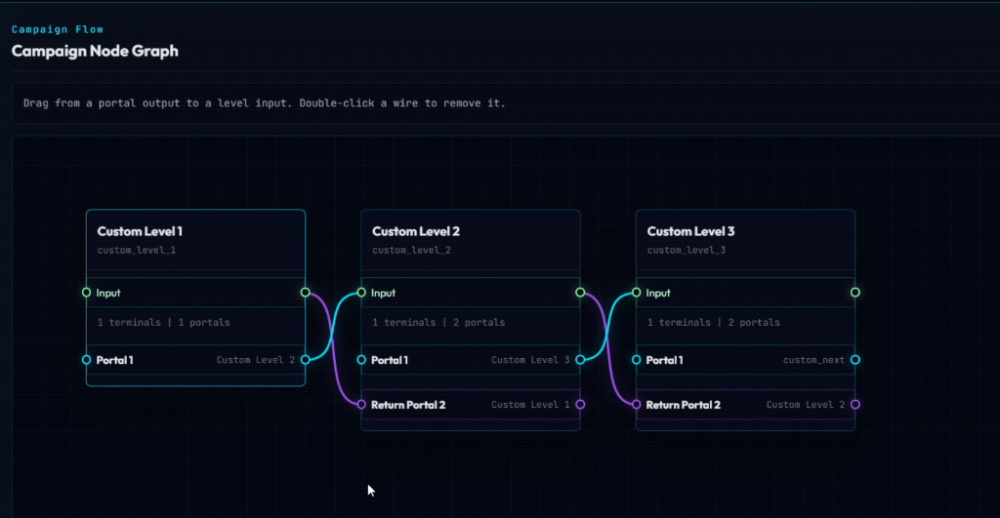

# Nexus-AI 🚀

[](https://opensource.org/licenses/MIT)

**Nexus-AI** is a 2D educational web game and User-Generated Content (UGC) platform designed to teach Python and MLOps through an immersive sci-fi narrative. Players step into the shoes of a space engineer writing real Python code to guide an AI companion. 

Beyond the core campaign, Nexus-AI features a complete suite of creator tools—including a Level Editor and a Campaign Manager—empowering educators and developers to build, wire, and share their own custom coding challenges and data science puzzles.



---

## ✨ Key Features

*   **In-Browser Sandbox**: Safely executes real Python code entirely within the browser. Supports synchronous `input()` calls via SharedArrayBuffer, ensuring a true Python terminal experience.
*   **State-Based Validation**: Moves beyond brittle Regex string-matching. The engine extracts the `pyodide.globals` namespace to validate the exact mathematical or logical state of the player's code (e.g., verifying if `df.shape == (50, 4)` or `model_accuracy > 0.85`).
*   **2D Tile Level Editor**: A intuitive "2D Minecraft-style" grid builder. Features tools for painting geometry, placing interactive entities (Terminals, Portals, Bot Buddy), and a unique "Void" brush to carve organic, non-rectangular map shapes.
*   **Custom Asset Pipeline**: Creators can upload `.png` or `.svg` files directly into the editor. Assets are instantly converted to Base64 and embedded seamlessly into the JSON save file.
*   **n8n-Style Campaign Node Graph**: A custom, zero-dependency SVG visual routing system. Utilizing dual-port symmetrical layouts and cubic Bezier curves, creators can visually wire multiple levels together into branching campaigns.

---

## 🛠️ Tech Stack

Nexus-AI is built with a focus on performance and minimal dependencies:

*   **Frontend**: Vanilla JavaScript, HTML5 Canvas, and CSS3 (featuring a sleek Glassmorphic UI). *Zero heavy frameworks (No React/Vue/Angular).*
*   **Python Runtime**: [Pyodide](https://pyodide.org/) running in a dedicated Web Worker to prevent UI blocking.
*   **IDE & Terminal**: [CodeMirror 6](https://codemirror.net/) for the code editor and [Xterm.js](https://xtermjs.org/) for the terminal interface.
*   **Level Engine**: Adapted core mechanics from `blurymind/tilemap-editor`.
*   **Data Storage**: Fully data-driven architecture using JSON files (`user_campaign.json`, `user_maps.json`), currently persisted to the browser's `localStorage`.
*   **Server**: A minimal [Node.js](https://nodejs.org/) static server is required strictly for setting `Cross-Origin-Opener-Policy` and `Cross-Origin-Embedder-Policy` headers. These headers are essential for enabling `SharedArrayBuffer` support.

---

## 🎨 Creator / User Guide

Welcome to the Nexus-AI UGC pipeline! Here is how you can create your own coding campaigns.



### 1. Painting the Map
Open the Level Editor from the main menu. You'll be greeted by the 2D grid builder.
*   Select your floor and wall tiles from the palette and paint the layout.
*   Use the **Void** brush to erase tiles and create non-rectangular, organic room shapes.
*   Place entities like the Player Spawn, Terminals, and Exit Portals onto the grid.



### 2. Configuring Terminal Validation
Every terminal represents a coding challenge. Select a terminal to open its configuration modal.
*   **Story/Hint Dialogue**: Write what the AI companion will tell the player.
*   **Validation Rules**: Define the expected Python namespace states. Instead of checking if the user typed specific words, you specify variables that must exist in the Pyodide environment and their expected values (e.g., `{"current_location": "Archives"}`).



### 3. Wiring the Node Graph
Once you have created multiple maps, head to the Campaign Manager to link them together.
*   Drag and drop your levels onto the canvas.
*   Click and drag from a level's output port to another level's input port. The engine draws a cubic Bezier curve to represent the flow.
*   This visual routing dictates where the Exit Portal in a given level will transport the player next.



### 4. Playtesting
*   Save your campaign (it will be embedded into `localStorage`).
*   Hit the **Play** button on your campaign to immediately jump in as a player and test your Python challenges, dialogue, and level flow!

---

## 🚀 Local Setup

To run Nexus-AI locally, you need to spin up the lightweight Node.js server. The server's primary responsibility is to inject the specific Cross-Origin headers (`COOP`/`COEP`) required by the browser to enable `SharedArrayBuffer`, which allows the Python Web Worker to handle synchronous terminal input.

### Prerequisites
*   [Node.js](https://nodejs.org/en/download/) installed on your machine.

### Installation

1.  **Clone the repository:**
    ```bash
    git clone https://github.com/ParthVarekar/coding_game.git
    cd coding_game
    ```

2.  **Start the server:**
    ```bash
    node server.js
    ```

3.  **Play the game:**
    Open your web browser and navigate to:
    ```
    http://localhost:3000
    ```

---

*Built with ❤️ for aspiring engineers and data scientists.*
